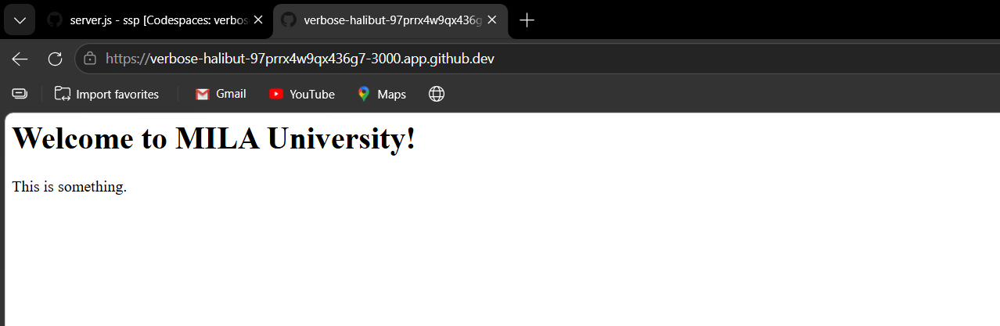
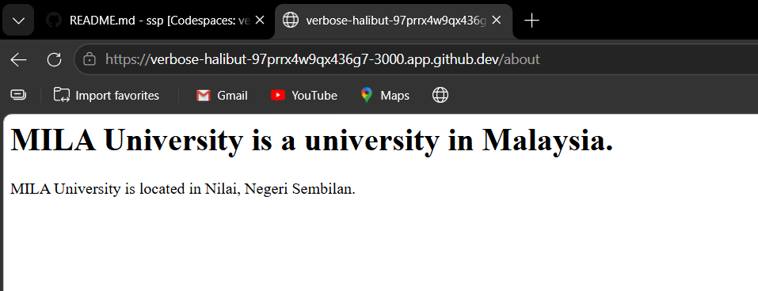
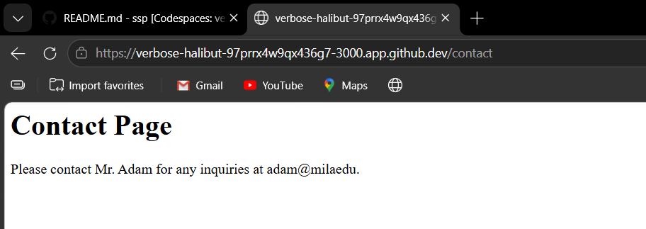
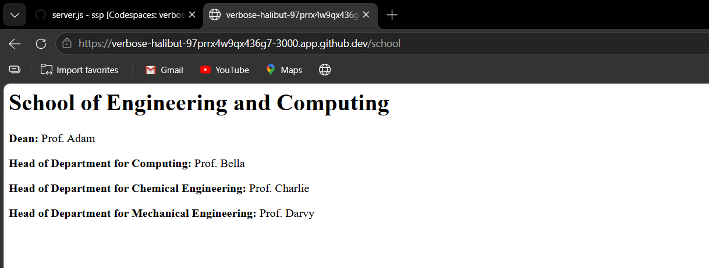
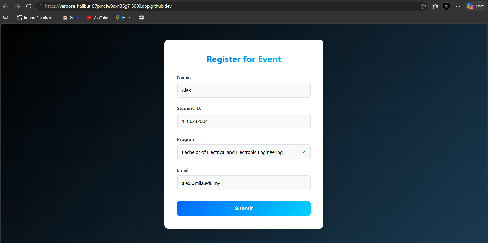
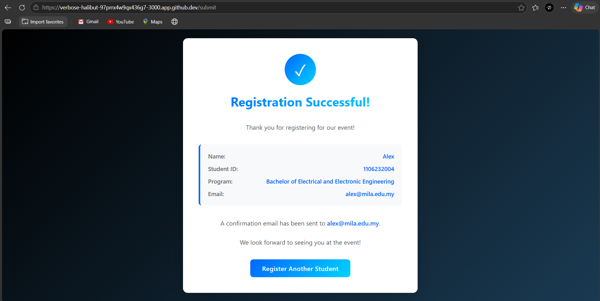
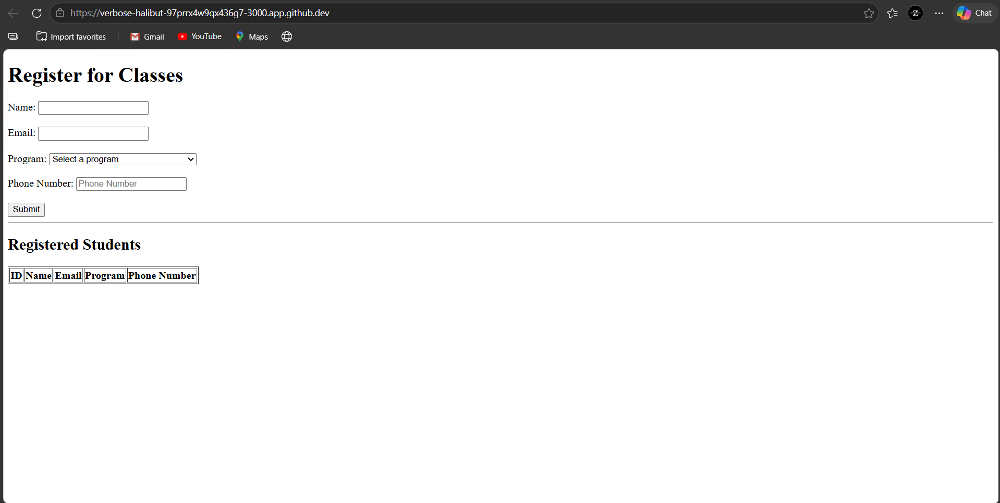
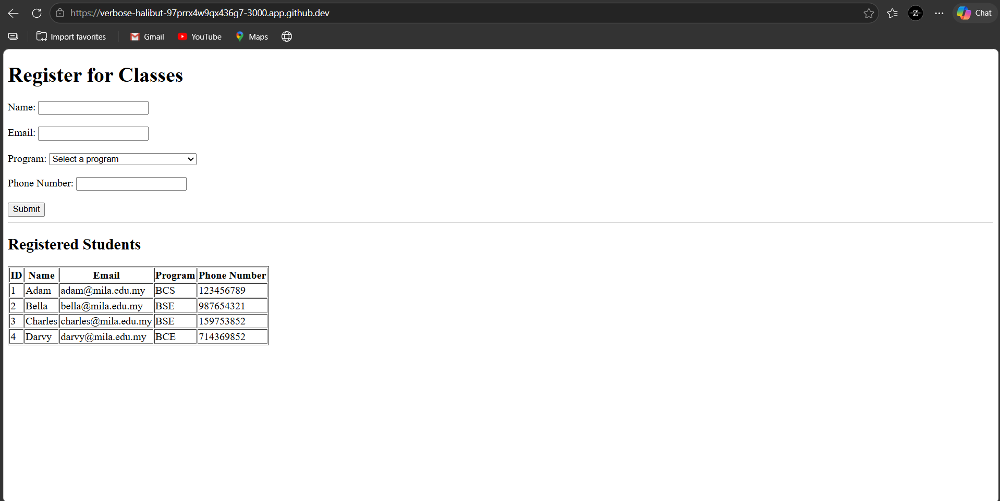
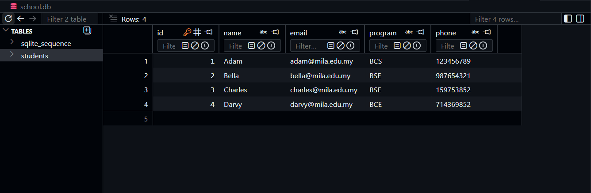
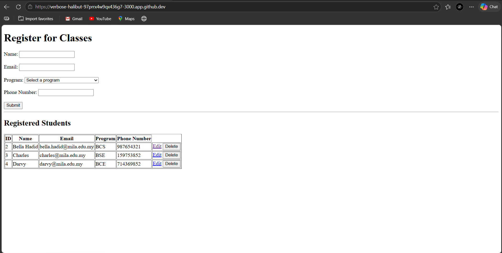

Name: Son Li Xuan  
ID: 1106232004

<h1>Lab 1: CLOUD ENVIRONMENT SETUP</h1>
In Lab 1, a cloud development environment is successfully set up using GitHub codespaces. Node.js and Express.js were successfuly initialised and installed, with multiple routes. Handling of HTTP GET requests was also been introduced. I also learned how to display HTML content in the browser and push my project files to GitHub for submission.   

<b>Output 1:</b> 

<b>Output 2:</b> 

<b>Output 3:</b> 
 

<b>Output 4:</b> 
 

<h2>Lab 2: EJS AND HTML FORM</h2>
In this lab, the View and Controller components of the MVC architecture were implemented by configuring the EJS template engine in Node.js. A dynamic HTML form was created to collect user information such as name, student ID, program, and email. Express middleware was used to parse the submitted form data, and an HTTP POST route was written to process the submission. The submitted data was then rendered dynamically on the success page using EJS. In addition, simple CSS styling was applied to improve the appearance and organization of both the form page and the result page. Through this lab, knowledge of server-side programming and dynamic web page rendering was strengthened.   

<b>Output (index.ejs):</b> 
 

<b>Output (success.ejs):</b> 
 

<h1>Lab 3: DATABASE SETUP AND READ/WRITE </h1>
In this lab, a database for a web application using SQLite was set and configured, and integrated it with an Express server. Establishing a connection to the SQLite database and crating a table to store student information, such as name and email was learned. A form was created in EJS to collect data from the user, which was the processed and inserted into the database using POST routes in the server. The data was dynamically rendered on the web page, providing a list of registered students. This lab emphasised practical skills in handling CRUD operations with a database and displaying dynamic data on the front end using EJS.   

<b>Output (index.ejs, empty form): </b> 
 

<b>Output (index.ejs, information filled): </b> 
 

<b>Output (database.js): </b> 
 

<h1>Lab 4: DATABASE SETUP AND UPDATE/DELETE </h1>
In this lab, the focus was on implementing CRUD (Create, Read, Update, Delete) operations in a web application using Express.js and SQLite. The database was set up to store student records, and a form was created to allow users to submit new student data, which was then saved in the database. The application was extended with functionalities to update and delete records. Using dynamic routing, the system allowed students to be edited or removed based on their unique ID. The application was tested to ensure that data was correctly added, displayed, and modified in the database. This lab enhanced the understanding of server-side programming and working with databases for interactive web applications.  

<b>Output: </b> 
 

